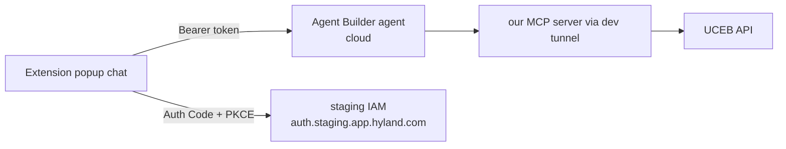

# Day 3

_Focus: build a cross-browser **extension chatbot** (Chromium + Firefox) with **OAuth Auth Code +
PKCE** browser-session auth, and connect it to the Hyland **Agent Builder** agent
(`a4374edc-32b0-4d01-bc45-8dbc496ed9c6`)._

---

## 1. Goal

A browser popup chatbot that:
1. Signs the user in via **OAuth Authorization Code + PKCE** (public client, no secret).
2. Sends the user's messages to the **agent's chat/run endpoint** with a `Bearer` token.
3. Shows the agent's replies (the agent internally calls our MCP tools).



---

## 2. Decisions (locked)

| Topic | Decision |
|---|---|
| Target browsers | **Chromium (Chrome/Edge) + Firefox**, Manifest V3 |
| Auth | **OAuth Authorization Code + PKCE** inside the extension (public client) |
| Code location | `browser-extension/` in the `MCP_Server_Agent` workspace |
| Agent endpoint | **TBD** - capture from admin portal / DevTools (see §3) |

---

## 3. The agent's chat endpoint (found in the docs)

Source: Content Intelligence docs -> **Agent Builder Platform -> AgentBuilderAPI**
(UserGuide **Endpoints** + the OpenAPI spec). No DevTools needed for the path.

**Synchronous invoke (what a chatbot uses):**
```
POST {base}/v1/agents/{agent_id}/versions/{version_id}/invoke
```
For our agent, using `latest` for the version:
```
POST {base}/v1/agents/a4374edc-32b0-4d01-bc45-8dbc496ed9c6/versions/latest/invoke
```

- **Auth:** `Authorization: Bearer <token>` (HTTPBearer).
- **Body** (`ChatRequestBaseSchema`):
  ```json
  { "messages": [ { "role": "user", "content": "List the document types" } ] }
  ```
- **Headers:** `User-Agent` (required; browsers send it automatically), optional **`X-Session-ID`**
  (a UUID to keep conversation context across turns), optional `X-Correlation-ID`.
- **Response** (`AgentResponse`): reply text is at `output[].content[].text` (items with
  `type: "message"` -> `type: "output_text"`). Tool calls appear as `output[]` items with
  `type: "function_call"`.
- Streaming alternative: `.../invoke-stream` (SSE). Async alternative: `POST .../runs` then poll
  `GET .../runs/{run_id}` or SSE `.../runs/{run_id}:stream`.

**Only unknown = the environment base host.** Almost certainly the Studio host
`appintel-dev-test.agent-studio.ai.dev.app.hyland.com`. Confirm with ONE DevTools capture:
send a message in Studio and check whether the request hits `.../v1/agents/...` directly or via
`.../bff/...`. Set it in `browser-extension/src/config.js` -> `agent.apiBaseUrl`.

Reference: OpenAPI spec download is linked from the docs Endpoints page (`openapi.yaml`).

---

## 4. PKCE dependency (IAM public client)

A browser extension can't keep a secret, so we need a **public/SPA client in IAM** with:
- **PKCE** enabled (no client secret),
- the extension **redirect URI** allow-listed. Get it by running `chrome.identity.getRedirectURL()`
  (the scaffold logs it on the first login attempt) - it looks like
  `https://<extension-id>.chromiumapp.org/`.

Set that client id in `config.js` (`auth.clientId`).

---

## 5. Progress

- [x] Decisions locked (browsers, auth, location).
- [x] Found the agent chat endpoint in the docs (invoke `/v1/agents/{id}/versions/latest/invoke`).
- [x] Scaffold MV3 extension shell (chat UI).
- [x] Wired the real invoke contract into `agent.js` + `config.js` (body, session header, reply parsing).
- [ ] Confirm the environment base host via one DevTools capture (`agent.apiBaseUrl`).
- [ ] Register the IAM public client + redirect URI (`auth.clientId`).
- [ ] Implement PKCE login in the extension. _(code ready; needs client id)_
- [ ] Test end-to-end.
